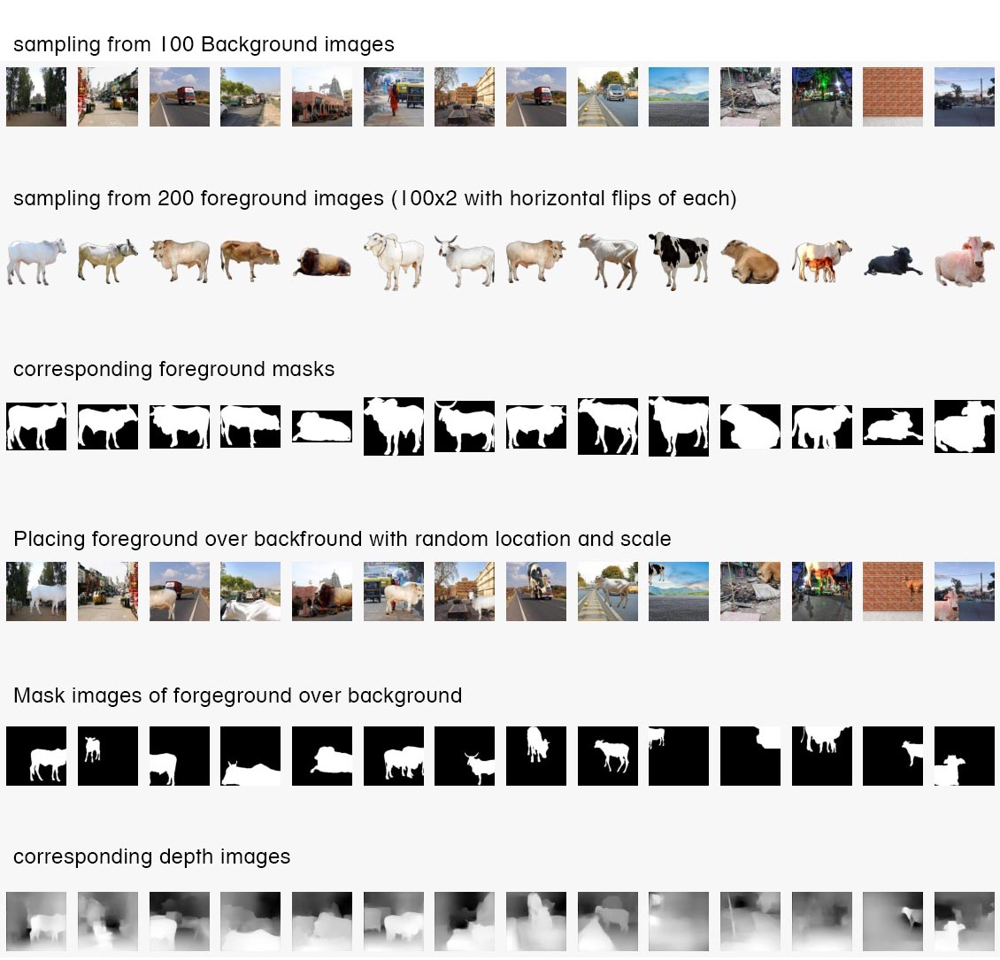

# S14/15A - Data Preparation

## Kinds of images and total counts

* 100 images of outdoor background scenes mostly with roads and fields both empty and populated. These are all landscape images.
* 100 foreground transparent images of cow/bull/calf and also extended them to 200 by flipping each horizontally (making them 200)
* We then randomly placed each foreground on each background 20 times making 400K images each of 224x224 resolution. 
* for each image we generated corresponding mask and depth image of same resolution.

## Size of dataset

* Total size is 6GB zipped and 8GB unzipped with each image approximately 7KB, each mask/depth approx 2KB. 
* While images are jpeg RGB with 60% quality, mask is binary and depth is grayscale image (both jpgs again with 60% quality).

## Statistics

### Mean

* fg_bg:
* mask:
* depth:

### Standard Deviation

* fg_bg:
* mask:
* depth:

## Sample images



## Process of Image Generation

We used nyu.h5 model for depth calcualtion from [dense depth](https://github.com/ialhashim/DenseDepth). This model requires input images to be of 448x448 resolution and produces 224x224 size depth image. We planned to run it with a batch of 1000.

To this effect we wrote a generator function to load the dataset at the same time create fg-bg and mask images for each processed batch.

```
1. for each background Image (100 of those, each of landscape orientation)
  1.1 resize background to (448*w/h)x448, where w and  is width and height of the background image
  1.2 for each foreground (original and flipped, 200 of those)
    1.2.1 repeat 20 times
      1. crop randomly 448x448 region of the resized background
      2. randomly pick a center point on image (two numbers in range 0 to 447 for x, y)
      3. randomly pick a scale between .3 and .6 indicating how much square area should fg overlap on bg
      4. resize the fg to scale and place it on top of bg centered at x, y calculated
      5. save it at 224x224 resolution in a zip folder
      6. calculate mask by setting a binary image to transparency channel of fg image, with trasparent = 0 amd non transparent=1
      7. save mask at 224x224 resolution
      8. add 448x448 image to numpy array for depth calculation
  1.3 if 100 images generated then yield the batch
  
2. run depth for one batch
3. save depth images of 224x224 in zipfolder
```
## Placement with Segmentation Experiment
