# S6

## Without L1 and L2

## Misclassified images without any L1 or L2 regularization

## Only L2

### Misclassified images with L2 regularization using lambda = 0.000001

### Misclassified images with L2 regularization using lambda = 0.00005
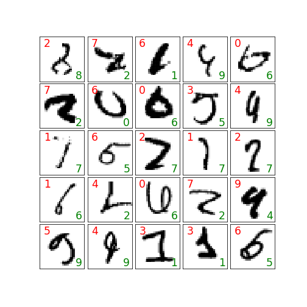

### Comparision of validation loss using various L2 Lambdas (no L1)
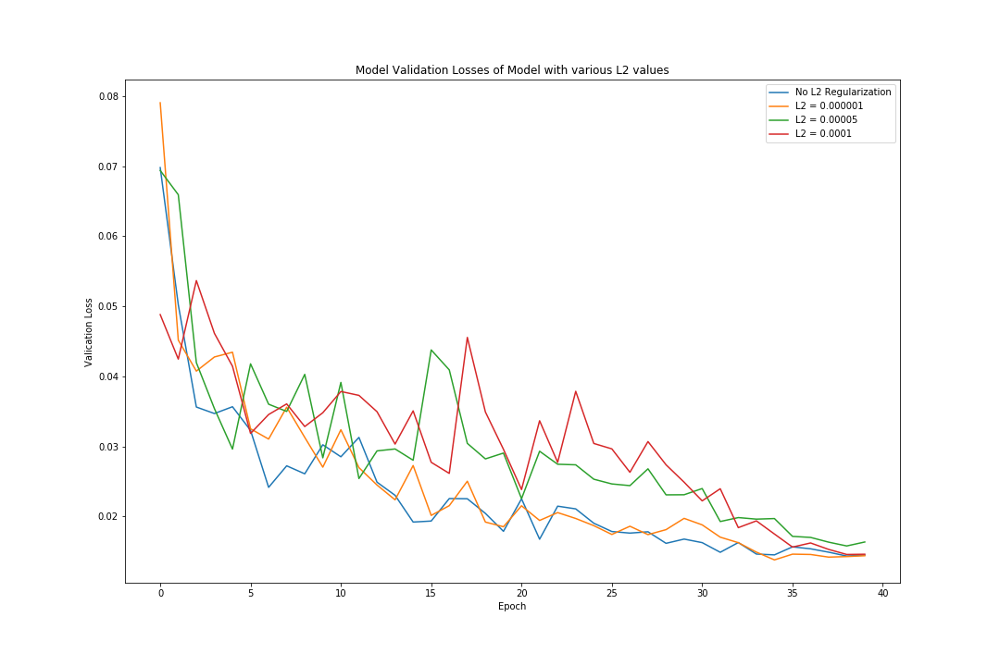

### Comparision of validation Accuracy using various L2 Lambdas (no L1)
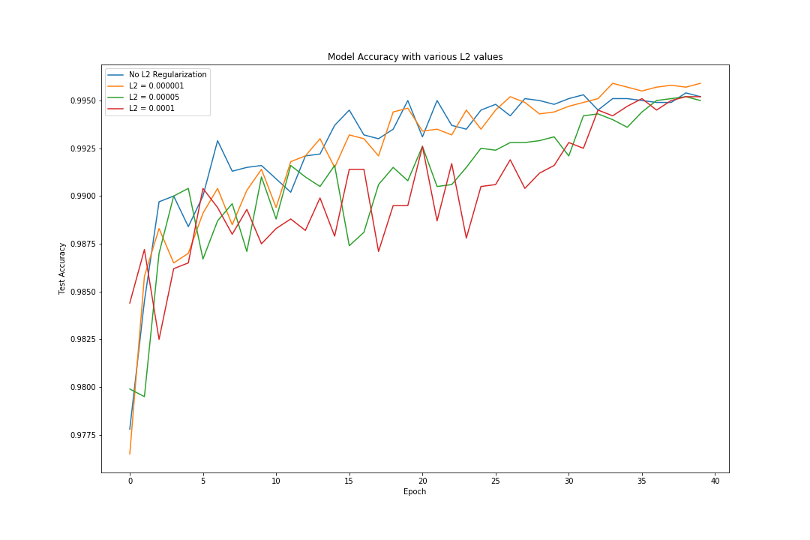

## Only L1

### Misclassified images with L1 regularization using lambda = 0.000001
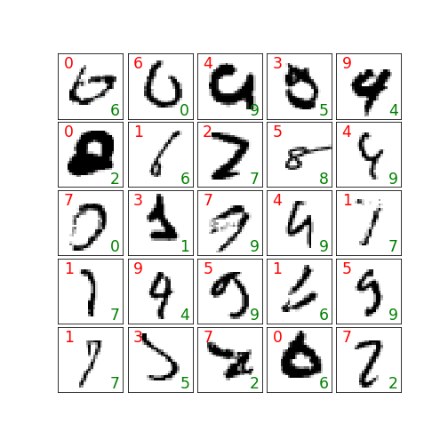

### Misclassified images with L1 regularization using lambda = 0.00005
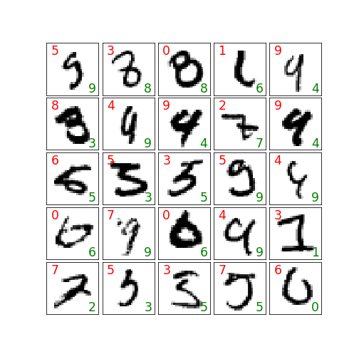

### Comparision of validation loss using various L1 Lambdas (no L2)
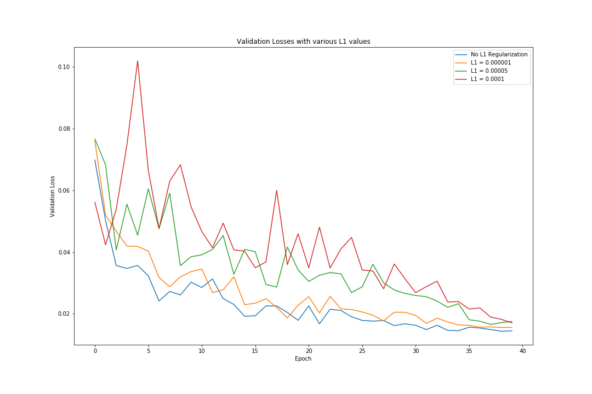

### Comparision of validation Accuracy using various L1 Lambdas (no L2)
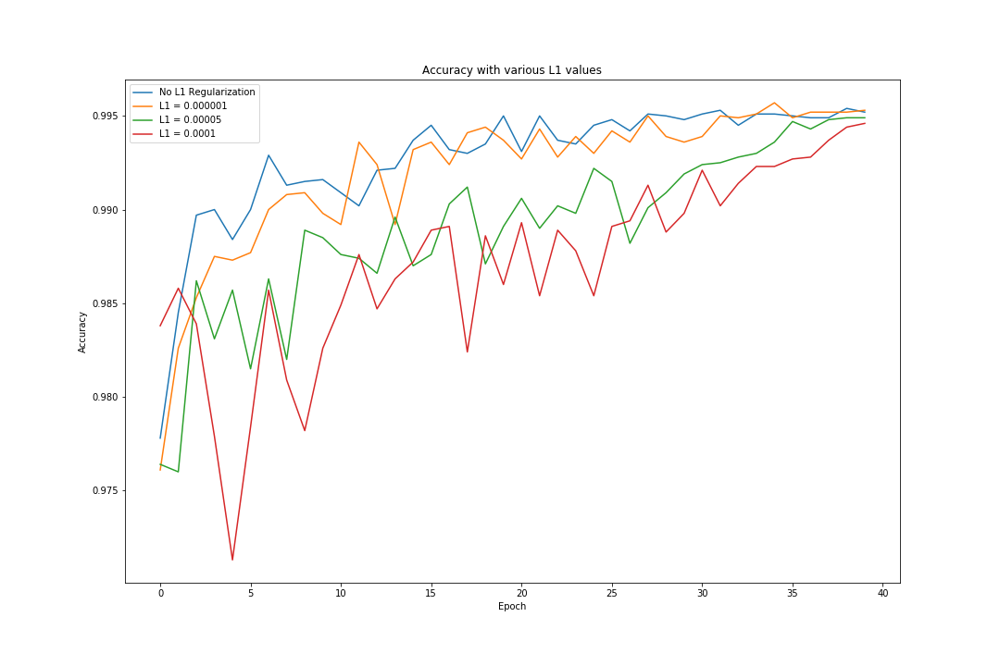

## Both L1 and L2

### Misclassified images with L1 and L2 regularization using lambda = 0.000001
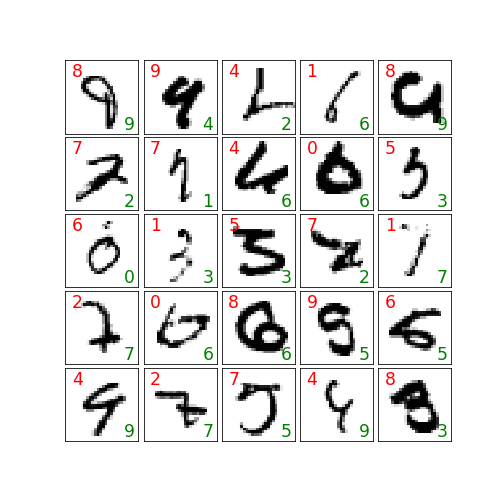

### Misclassified images with L1 nd L2 regularization using lambda = 0.00005
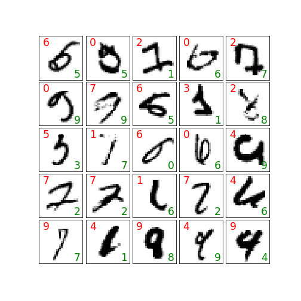

### Comparision of validation loss using various L1 and L2 Lambdas (no L1)
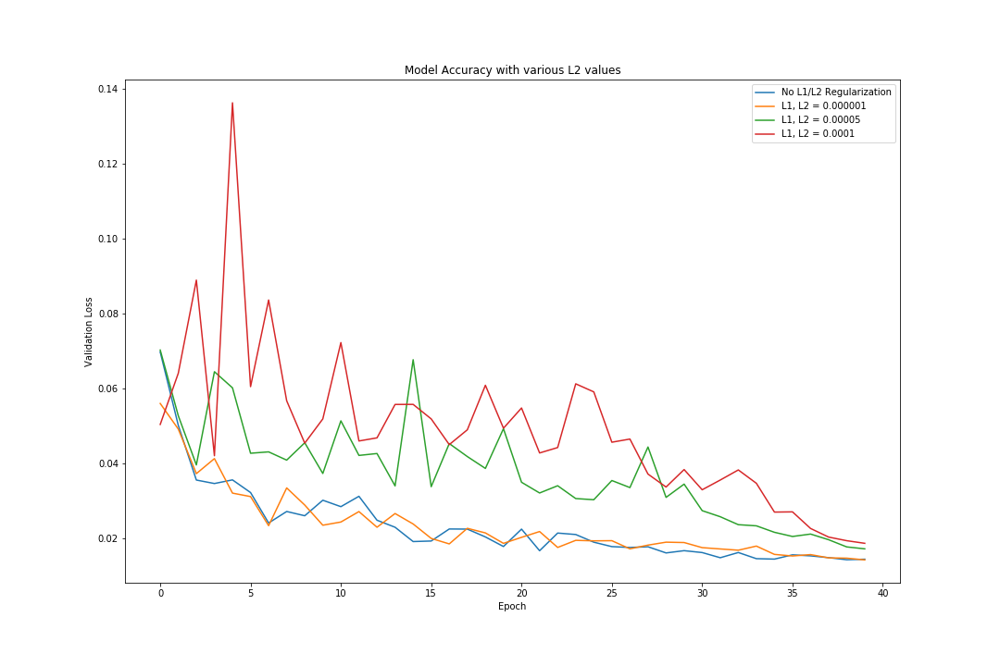

### Comparision of validation Accuracy using various L1 and L2 Lambdas (no L1)
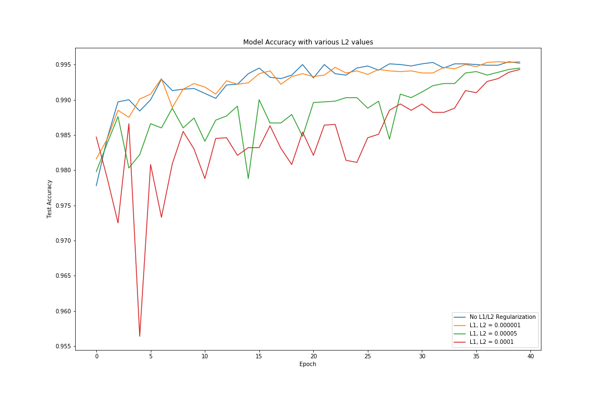
