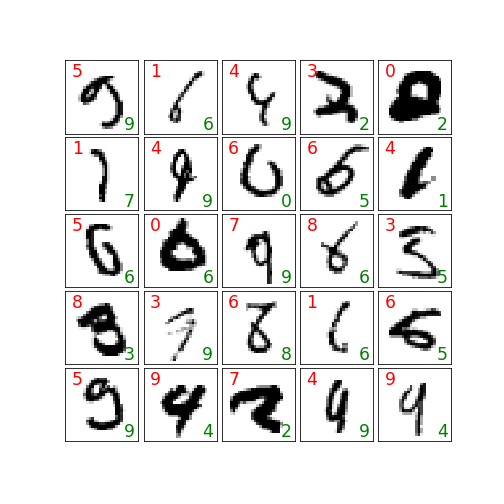

# S6

* [Main jupiter notebook](EVA04_S6.ipynb)
* [visualizations](S6_Visualizations.ipynb)

### Highlights
* Refactored all parts in classes/functions so that it is easy to split them in files later
* Used Google Drive to store best model and all the model stats so that visualzation can be done later separately
* in misclassified images, actual label is in Green and predicted label is in Red

### Observations
* L1 and L2 regularizations reduced the train / test accuracy
* Lambdas for L1/L2 must be small. For larger values the accuracy drops significantly.

## Without L1 and L2

### Misclassified images without any L1 or L2 regularization

## Only L2

### Misclassified images with L2 regularization using lambda = 0.000001

### Misclassified images with L2 regularization using lambda = 0.00005

### Comparision of validation loss using various L2 Lambdas (no L1)

### Comparision of validation Accuracy using various L2 Lambdas (no L1)

## Only L1

### Misclassified images with L1 regularization using lambda = 0.000001

### Misclassified images with L1 regularization using lambda = 0.00005

### Comparision of validation loss using various L1 Lambdas (no L2)

### Comparision of validation Accuracy using various L1 Lambdas (no L2)

## Both L1 and L2

### Misclassified images with L1 and L2 regularization using lambda = 0.000001

### Misclassified images with L1 nd L2 regularization using lambda = 0.00005

### Comparision of validation loss using various L1 and L2 Lambdas (no L1)

### Comparision of validation Accuracy using various L1 and L2 Lambdas (no L1)

## Best in each of 4 categories

### Comparision of validation loss

### Comparision of validation Accuracy

## Large L1/L2 spoils

### Large L2

### Large L1

